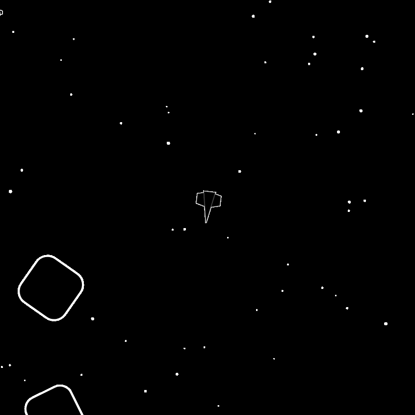

# Asteroids

## Playing It

https://asteroid-canvas.mcdrmtt.co/

## About

This is a relatively standard version of the classic Asteroids game implemented in vanilla JavaScript with no runtime dependencies.

## Development

1. Checkout the repository.
2. Run `npm install` to install `esbuild` (used to bundle the game file and run the development server).
3. Run using `npm start`.
4. Open `http://localhost:8000`
5. You can now modify the game code while it is running. It uses a custom HMR (hot-module reloading) system that allows any game file (except `platform.mjs`) to be modified while the game is running, without losing the game state.
6. THe game state is exposed in the console as `window._gameState`, so you can modify it as you want while the game is running.

## Todo

There are a number of improvements to make or missing features to add:

- Sound and music
- Gamepad
- Refactor the GUI code
- Bug fixes
- Game balance (difficulty, rewards, etc)
